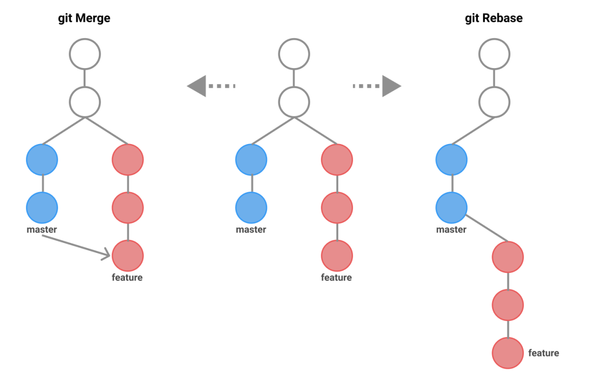
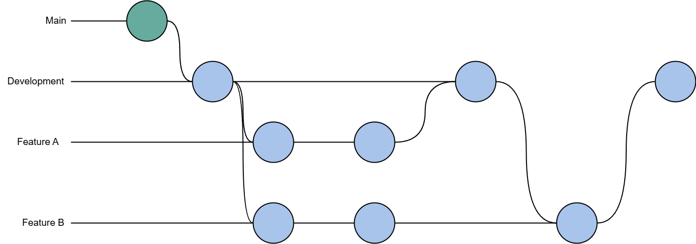

# Tutorial APAP

## Authors

* **Thaariq Kurnia Spama** - *2206082801* - *B* 
## Tutorial 1

### Apa yang telah saya pelajari hari ini
(Anda boleh menambahkan catatan apapun di bagian ini.Masukkan juga pertanyaan yang diikuti jawaban di setiap nomor, contoh seperti dibawah.)
### GitLab
1. Apa itu Issue Tracker? Apa saja masalah yang dapat diselesaikan dengan fitur Issue?
Issue Tracker merupakan alat yang digunakan oleh tim pengembang perangkat lunak untuk mencatat, mengelola, melacak masalah dengan tujuan bisa memprioritaskan dan menyelesaikan masalah atau bug yang dialami pada tim pengembang. Masalah yang bisa diselesaikan seperti bug, task, subtask, story dan masih banyak lagi.
2. Saat membuat Merge Request, terdapat 2 merge options. Jelaskan fungsi dari kedua pilihan tersebut! Mengapa hanya squash yang diceklis?
"Delete source branch when merge request is accepted", berfungsi untuk menghapus branch sumber secara otomatis setelah merge request diterima dan diproses. Ini membantu menjaga kebersihan repositori dengan menghilangkan branch yang sudah tidak diperlukan lagi setelah perubahannya digabungkan ke branch utama. Namun, opsi ini tidak dicentang dalam gambar, mungkin karena tim ingin menyimpan branch sumber untuk referensi atau alasan lain.
"Squash commits when merge request is accepted". Fungsi squash adalah menggabungkan semua commit dalam branch sumber menjadi satu commit tunggal saat digabungkan ke branch tujuan. Ini membuat history Git lebih rapi dan mudah dibaca, terutama jika branch sumber memiliki banyak commit kecil atau commit "work in progress".
Alasan hanya mencentang squash agar tim dapat menjaga history Git tetap rapi dan fokus pada perubahan akhir yang penting, sambil tetap mempertahankan branch sumber sebagai cadangan atau referensi. Squash memungkinkan semua commit dalam branch sumber digabungkan menjadi satu commit yang mencerminkan progress terbaru, membuat history lebih mudah dibaca dan dipahami. Sementara itu, dengan tidak menghapus branch sumber, tim memiliki fleksibilitas untuk kembali ke versi sebelumnya jika diperlukan, atau menggunakan branch tersebut untuk keperluan lain di masa depan. Pendekatan ini menyeimbangkan kebutuhan untuk menjaga history Git yang bersih dengan keinginan untuk mempertahankan informasi dan opsi yang mungkin berguna di kemudian hari.
3. Apa keunggulan menggunakan Version Control System seperti Git dalam pengembangan suatu aplikasi?
Penggunaan Version Control System (VCS) seperti Git dalam pengembangan aplikasi memiliki beberapa keunggulan penting. VCS memungkinkan tim developer untuk bekerja sama dengan lebih efisien, melacak perubahan kode, dan mengelola berbagai versi proyek. Dengan Git, tim dapat membuat cabang (branch) terpisah untuk mengerjakan fitur baru tanpa mengganggu kode utama, kemudian menggabungkannya kembali saat sudah siap. Selain itu, Git juga memudahkan proses backup dan pemulihan kode, serta membantu dalam menyelesaikan konflik saat beberapa orang mengerjakan file yang sama.
### Spring
4. Apa itu Gradle? Mengapa kita menggunakan Gradle? Apakah ada alternatif dari Gradle?
Gradle adalah sebuah build automation tool yang digunakan dalam pengembangan perangkat lunak. Alasan menggunakan Gradle karena mempermudah proses kompilasi, pengujian, dan pengemasan aplikasi. Gradle menggunakan bahasa DSL (Domain Specific Language) berbasis Groovy atau Kotlin yang lebih fleksibel dan mudah dibaca dibandingkan XML. Beberapa alternatif Gradle termasuk Maven dan Ant, namun Gradle sering dipilih karena kinerjanya yang lebih cepat dan kemampuannya dalam menangani proyek yang kompleks dengan lebih baik
5. Apa perbedaan dari @RequestParam dan @PathVariable?
*@RequestParam* dan *@PathVariable* adalah dua cara untuk mengambil data dari URL, namun memiliki perbedaan dalam penggunaan. *@RequestParam* digunakan untuk mengambil parameter query dari URL, biasanya dalam format "?key=value". Sementara itu, *@PathVariable* digunakan untuk mengambil nilai yang menjadi bagian dari path URL itu sendiri. Pemilihan antara keduanya tergantung pada desain API dan bagaimana data ingin direpresentasikan dalam URL.
6. Apa itu DTO? Apakah DTO harus selalu digunakan? Kapan sebaiknya kita menggunakan DTO?
DTO (Data Transfer Object) adalah objek sederhana yang digunakan untuk mengirim data antara berbagai bagian aplikasi, terutama antara backend dan frontend. DTO berfungsi seperti wadah khusus yang membungkus data, memungkinkan kita untuk mengontrol informasi yang dikirim ke client, meningkatkan keamanan dengan menyembunyikan data sensitif, dan memberikan fleksibilitas dalam format data. Meskipun tidak selalu diperlukan, DTO sangat berguna dalam aplikasi Spring Boot yang kompleks, terutama ketika kita perlu memisahkan representasi data yang dikirim dari model data internal, meningkatkan performa dengan mengirim hanya data yang diperlukan, atau ketika struktur data yang disimpan di database berbeda dengan yang dibutuhkan oleh frontend. Penggunaan DTO membantu membuat API lebih aman, efisien, dan mudah dikelola seiring berkembangnya aplikasi.
7. Jelaskan bagaimana alur ketika kita menjalankan http://localhost:8080/roman-converter/MMXXIV sampai dengan muncul keluarannya di browser!
Ketika kita menjalankan http://localhost:8080/roman-converter/MMXXIV , fungsi ```romanConverterWithPathVariable``` akan terpanggil dahulu karena url yang kita jalankan itu menggunakan path variable. Fungsi ini akan memproses path variable ```MMXXIV``` yang diterima dari URL dan kemudian memanggil fungsi ```getRomanConverterPage```. Di dalam ```getRomanConverterPage```, sebuah objek ```RomanConverter``` akan dibuat dengan parameter ```MMXXIV```. Fungsi ini kemudian memeriksa apakah input ```MMXXIV``` adalah string yang valid untuk angka Romawi menggunakan ekspresi reguler. Jika valid, objek ```RomanConverter``` ditambahkan ke model dengan nama atribut "romanConverter", dan tampilan yang sesuai, yaitu ```view-conversion-result.html```, akan dikembalikan untuk dirender. Jika input tidak valid, sebuah pesan kesalahan akan ditambahkan ke model, dan tampilan yang sama akan dikembalikan dengan informasi error. Setelah tampilan dirender oleh Thymeleaf, hasilnya akan dikirimkan kembali sebagai respons HTTP ke browser, yang kemudian menampilkan hasil konversi atau pesan kesalahan sesuai dengan data yang diberikan.
8. Jelaskan bagaimana alur ketika kita menjalankan http://localhost:8080/roman-converter?roman=MMXXIV sampai dengan muncul keluarannya di browser!
Ketika kita menjalankan URL http://localhost:8080/roman-converter?roman=MMXXIV, fungsi ```romanConverterWithReqParam``` akan terpanggil terlebih dahulu karena URL ini menggunakan query parameter. Fungsi ini akan menerima parameter roman dengan nilai ```MMXXIV``` dari query string dan kemudian memanggil fungsi ```getRomanConverterPage```. Di dalam ```getRomanConverterPage```, sebuah objek ```RomanConverter``` akan dibuat dengan parameter ```MMXXIV```. Fungsi ini kemudian memeriksa apakah input ```MMXXIV``` adalah string yang valid untuk angka Romawi menggunakan ekspresi reguler. Jika valid, objek ```RomanConverter``` ditambahkan ke model dengan nama atribut "romanConverter", dan tampilan yang sesuai, yaitu ```view-conversion-result.html```, akan dikembalikan untuk dirender. Jika input tidak valid, sebuah pesan kesalahan akan ditambahkan ke model, dan tampilan yang sama akan dikembalikan dengan informasi error. Setelah tampilan dirender oleh Thymeleaf, hasilnya akan dikirimkan kembali sebagai respons HTTP ke browser, yang kemudian menampilkan hasil konversi atau pesan kesalahan sesuai dengan data yang diberikan.
9. Jelaskan bagaimana alur ketika kita menjalankan http://localhost:8080/convert sampai dengan muncul keluarannya di browser!
Ketika kita mengunjungi http://localhost:8080/convert, browser mengirimkan permintaan GET ke URL tersebut. Spring Boot kemudian memanggil fungsi ```getRomanCoverterWithView``` di controller, yang membuat objek ```RequestDTO``` dan menambahkannya ke model. Fungsi ini lalu mengembalikan nama template ```form.html```, yang digunakan oleh Thymeleaf untuk membuat halaman web dengan form input. Halaman form ini dikirim kembali ke browser, memungkinkan pengguna untuk memasukkan angka yang ingin dikonversi. Setelah form diisi dan dikirim, data form tersebut dikirim sebagai permintaan *POST* ke URL yang sama, yang ditangani oleh fungsi ```postRomanConverterWithView```. Fungsi ini mengambil nilai dari form, lalu memanggil fungsi ```getRomanConverterPage``` untuk melakukan konversi angka Romawi. fungsi ```getRomanConverterPage``` memeriksa validitas input dan menyiapkan hasil konversi atau pesan error. Akhirnya, hasil konversi atau pesan error dikirim ke browser dan ditampilkan kepada pengguna di halaman ```view-conversion-result.html```.
10. Pada Tutorial 1 - Panduan bagian Spring Boot > VS Code / IDE > langkah 4, kita mendapati error. Apa penyebabnya? Tip: Kamu bisa melihat commit dengan nama `feat: tutorial 1 - initialize spring boot project` untuk melihat versi kode di langkah tersebut.
Error ini muncul saat awal inisiasi proyek Spring Boot karena belum ada konten atau endpoint yang didefinisikan. Ketika menjalankan ./gradlew bootRun dan mengakses http://localhost:8080, aplikasi menampilkan "Whitelabel Error Page" dengan pesan 404 Not Found. Ini adalah perilaku normal untuk proyek baru yang belum memiliki controller atau rute yang dikonfigurasi. Meskipun terlihat seperti kesalahan, sebenarnya ini menunjukkan bahwa server Spring Boot sudah berjalan dengan baik, hanya saja belum ada konten yang bisa ditampilkan. Untuk mengatasi ini, langkah selanjutnya adalah membuat controller dan mendefinisikan endpoint, sehingga aplikasi dapat merespons permintaan dengan konten yang sesuai.

### Apa yang belum saya pahami
Pada tutorial kali ini, saya belajar banyak hal tentang pengembangan website dan framework baru yaitu Spring Boot. Namun ada beberapa hal yang kurang saya pahami juga seperti :
- [ ] Kenapa saya menggunakan Lombok? 
- [ ] Kenapa dependencies saya ada yang tidak bisa digunakan padahal sudah aktif ketika run project ? contohnya dev-tools saya yang sudah aktif namun live reloadsnya tidak berlaku atau tidak bisa digunakan
- [ ] Penerapan pada penggunaan function di Controller yang baru saya tahu dan membuat saya bingung penggunaannya
- [x] Apa itu DTO?
Objek sederhana yang digunakan untuk mengirim data antara berbagai bagian aplikasi, terutama antara backend dan frontend

****************************************************************

## Tutorial 2

### Apa yang telah saya pelajari hari ini
Pada Lab Tutorial 2 kali ini, saya belajar beberapa hal seperti penggunaan service yang biasanya digunakan untuk mengelola data dari controller.
### GitLab
1. Jelaskan kegunaan DTO pada proyek ini? Apakah bisa jika sebuah proyek tidak menggunakan DTO sama sekali?
DTO (Data Transfer Object) di proyek ini digunakan sebagai perantara untuk mentransfer data antara client dan server. DTO membantu membuat data yang dikirim lebih terstruktur dan jelas, serta hanya mengirimkan data yang diperlukan. Ini juga meningkatkan keamanan dengan menghindari pengiriman data sensitif dan membuat kode lebih mudah dipelihara. Tanpa DTO, proyek bisa berjalan, tapi mungkin menjadi lebih sulit untuk mengelola data, menjaga keamanan, dan memahami kode.
Referensi - https://realabishan.medium.com/data-transfer-object-dto-spring-mvc-506cd5340764
2. Apa itu UUID? Mengapa UUID digunakan? Pada proyek ini, UUID digunakan sebagai apa?
UUID (Universally Unique Identifier) adalah sebuah kode unik sepanjang 36 karakter yang digunakan untuk memberikan identifikasi yang sangat unik untuk data. UUID membantu memastikan bahwa setiap item, seperti baris data dalam tabel, memiliki ID yang tidak akan pernah sama dengan yang lain, bahkan jika berasal dari sistem yang berbeda. Dalam proyek ini, UUID digunakan untuk memberikan ID unik pada setiap proyek, sehingga setiap proyek dapat dibedakan dengan jelas tanpa khawatir ada ID yang sama dengan proyek lain, meskipun data tersebut berasal dari sumber yang berbeda.
Referensi - https://www.cockroachlabs.com/blog/what-is-a-uuid/
3. Pada service, mengapa perlu ada pemisahan antara interface dan implementasinya? Apa keuntungan pemisahan tersebut?
Pemisahan antara interface dan implementasi penting karena memungkinkan fleksibilitas dan penggunaan ulang kode. Interface hanya mendefinisikan metode yang harus ada tanpa menentukan cara pelaksanaannya, sementara implementasi memberikan detail cara kerja metode tersebut. Ini membuat kode lebih mudah diubah dan diatur, karena Anda bisa mengganti cara kerja tanpa mempengaruhi bagian lain dari kode yang menggunakan interface.
Referensi - https://medium.com/@Goamhobala/the-java-basics-interface-and-implementation-339d573d9b8a
4. Menurut kamu anotasi @Autowired pada class Controller tersebut merupakan implementasi dari konsep apa? Dan jelaskan secara singkat cara kerja @Autowired tersebut dalam konteks service dan controller yang telah kamu buat.
Anotasi @Autowired pada class Controller menerapkan konsep Dependency Injection, di mana Spring otomatis menyediakan dependensi yang diperlukan tanpa kita buat manual. Ini memungkinkan Spring untuk menginjeksi service ke dalam controller, sehingga controller bisa menggunakan service tersebut tanpa harus membuatnya sendiri, membuat kode lebih rapi dan mudah diatur.
Referensi - https://medium.com/@youeleven/what-is-autowired-in-spring-boot-7285530a55b8  
5. Apa perbedaan @GetMapping dan @PostMapping? Kapan @GetMapping dan @PostMapping digunakan?
```@GetMapping``` dan ```@PostMapping``` adalah cara di Spring Framework untuk menangani jenis permintaan HTTP yang berbeda. ```@GetMapping``` digunakan untuk permintaan GET dan biasanya digunakan untuk mengambil atau melihat data dari server. Misalnya, jika kita ingin melihat informasi di halaman web, Kita akan menggunakan ```@GetMapping```. Sebaliknya, ```@PostMapping``` digunakan untuk permintaan POST, yang biasanya digunakan untuk mengirimkan data ke server, seperti saat menambahkan atau memperbarui informasi. Jadi, gunakan ```@GetMapping``` untuk melihat data dan ```@PostMapping``` untuk mengirimkan data.
Referensi - https://www.java67.com/2023/09/difference-between-getmapping.html
6. Apakah terdapat jenis mapping lain yang dapat digunakan? Jelaskan minimal 3 jenis mapping lain!
Selain ```@GetMapping``` dan ```@PostMapping```, ada juga beberapa jenis mapping lain yang digunakan dalam Spring Framework untuk menangani berbagai jenis permintaan HTTP. ```@PutMapping``` digunakan untuk mengganti seluruh informasi yang ada dengan informasi baru. ```@DeleteMapping``` digunakan untuk menghapus informasi yang sudah ada. ```@PatchMapping``` digunakan untuk memperbarui sebagian informasi yang ada, bukan seluruhnya. Masing-masing jenis mapping ini memiliki tujuan spesifik untuk mengelola data dengan cara yang tepat sesuai dengan operasi yang dilakukan.
Referensi - https://medium.com/@seonggil/spring-getmapping-putmapping-postmapping-deletemapping-patchmapping-difference-984a86520aad 
7. Jelaskan proses yang terjadi di controller, model, dan service pada proses create proyek, mulai dari fungsi addFormProyek hingga pengguna menerima halaman success-add-proyek.
Pertama, fungsi addFormProyek akan dipanggil dan berupa GetMapping yang kemudian akan me-return view html nya. Di view html tersebut, user akan mengisi form yang kosong yang kemudian akan disubmit karena form tersebut merupakan method ```POST``` sehingga fungsi addProyek dengan @PostMapping akan menerima url tersebut dan dijalankan fungsinya. Fungsi addProyek yang ada di controller ini akan set atau membuat proyek baru dengan cara memanggil fungsi addProyek yang ada di Service dengan valuenya yang dibawa dari form sebelumhya. Di fungsi addProyek pada Service akan set proyek baru dan dimasukkan ke arraylist Proyek. Jika berhasil, fungsi addProyek di controller akan return view html yang menampilkan view success add proyek tersebut.
Referensi - https://medium.com/javarevisited/rest-api-using-spring-boot-part-2-adding-model-service-controller-and-dao-implementation-697284b4ff38
8. Jelaskan mengenai th:object!
Atribut ```th:object``` dalam Thymeleaf digunakan untuk menentukan objek yang akan menjadi konteks untuk ekspresi-ekspresi lain di dalam elemen tersebut. Ini sangat berguna ketika bekerja dengan form, di mana ```th:object``` biasanya digunakan pada elemen <form> untuk menentukan objek model yang terkait dengan form tersebut. Penggunaan ```th:object``` memungkinkan pengembang untuk mereferensikan properti-properti objek tersebut secara lebih singkat dalam elemen-elemen form anak, tanpa perlu mengulangi nama objek setiap kali.
Referensi - https://www.thymeleaf.org/doc/tutorials/3.0/thymeleafspring.html#creating-a-form
9. Jelaskan mengenai th:field!
Atribut ```th:field``` adalah salah satu fitur penting dalam Thymeleaf yang digunakan khusus untuk menangani input form. Atribut ini biasanya digunakan pada elemen-elemen input seperti <input>, <select>, dan <textarea>. Ketika digunakan bersama dengan th:object, ```th:field``` memungkinkan binding dua arah antara elemen form di sisi klien dan properti objek di sisi server. Ini berarti nilai dari elemen form akan secara otomatis diisi dengan nilai properti objek yang sesuai saat rendering, dan sebaliknya, nilai yang diinput oleh pengguna akan secara otomatis dipetakan ke properti objek yang sesuai saat form disubmit. Penggunaan ```th:field``` juga membantu dalam validasi form dan penanganan error.
Referensi - https://www.thymeleaf.org/doc/tutorials/3.0/thymeleafspring.html#binding-to-fields.
10. Apakah terdapat jenis “th” lainnya? Jelaskan minimal 3 jenis “th” lainnya yang kamu temukan!
Selain th:object dan th:field, Thymeleaf menyediakan berbagai jenis atribut "th" lainnya untuk memanipulasi tampilan dan logika pada halaman HTML. Tiga jenis atribut "th" lainnya yang sering digunakan adalah: ```th:text``` untuk menampilkan teks dinamis, ```th:if``` untuk menerapkan kondisi rendering elemen, dan ```th:each``` untuk melakukan iterasi pada koleksi data. Atribut ```th:text``` memungkinkan pengembang untuk menyisipkan nilai variabel atau ekspresi ke dalam konten elemen HTML. Atribut ````th:if```` digunakan untuk merender elemen secara kondisional berdasarkan ekspresi boolean. Sedangkan ```th:each``` memungkinkan pengulangan elemen HTML untuk setiap item dalam koleksi, seperti list atau array.
Referensi - https://www.thymeleaf.org/doc/tutorials/3.0/usingthymeleaf.html#literals


### Apa yang belum saya pahami
Ada beberapa hal yang kurang saya pahami juga seperti :
- [ ] detail dari @Auotwired
- [ ] Mengapa ada suatu construstor tapi di buat dalam 2 file yang berbeda yaitu proyekDTO.java dan proyek.java

<details>
<summary>
<h2>Tutorial 3</h2>
</summary>
Pertanyaan
1. Jelaskan seluruh configuration properties (application, datasource, jpa) yang terdapat di dalam file application.yml!
2. Pada tutorial ini, kita menggunakan docker container untuk membentuk database. Apa keuntungan menggunakan docker container dibandingkan tanpa menggunakannya?
3. Jelaskan secara singkat apa itu dan kegunaan dari annotation dibawah ini
(@Entity, @Table, @Column)
4. Pada model, kita dapat menentukan relasi antarmodel dengan menggunakan JPA Annotation. Sebutkan seluruh JPA Annotation yang dapat digunakan untuk mendefinisikan relasi antarmodel beserta perbedaannya!
5. Pada model Proyek, terdapat annotation @JoinTable seperti berikut
Jelaskan kegunaan annotation tersebut beserta seluruh parameternya!
6. Jelaskan mengapa kita harus membentuk JPA Repository!
7. Sebutkan beberapa alternatif dari Java Faker!

Jawabann
1. File konfigurasi application.yml yang disediakan untuk aplikasi Spring Boot mencakup beberapa properti penting yang dibagi menjadi pengaturan aplikasi, konfigurasi datasource, dan pengaturan JPA. Di bagian spring.application.name, aplikasi ini dinamakan "manpromanpro". Bagian datasource menentukan detail koneksi untuk database PostgreSQL, termasuk URL (jdbc:postgresql://localhost:15001/manpromanpro), username (postgres), dan password (secret99). Bagian jpa mengonfigurasi properti Hibernate, seperti mengatur dialek ke org.hibernate.dialect.PostgreSQLDialect, mengaktifkan pembuatan LOB (Large Object) tanpa konteks, dan menentukan bahwa skema harus dibuat dari awal dengan ddl-auto: create. Format yang terstruktur ini memungkinkan pengorganisasian yang jelas dan memudahkan pengelolaan konfigurasi di berbagai environment, sehingga meningkatkan keterbacaan dan pemeliharaan dibandingkan dengan file properti tradisional.
Referensi : https://hantsy.gitbook.io/build-a-restful-app-with-spring-mvc-and-angularjs/boot-gs/datasource
2. Menggunakan Docker Container untuk mengatur database memiliki beberapa keuntungan dibandingkan tidak menggunakan. Salah satu manfaat utamanya adalah konsistensi environment, karena Docker memastikan aplikasi berjalan dengan cara yang sama di berbagai environment, sehingga menghindari masalah terkait perbedaan konfigurasi. Selain itu, Docker Container lebih ringan dan membutuhkan sumber daya lebih sedikit dibandingkan dengan mesin virtual, yang memungkinkan penyebaran dan penskalaan aplikasi yang lebih cepat. Efisiensi ini semakin ditingkatkan dengan kemampuan untuk dengan cepat membuat, menghancurkan, dan mengelola kontainer, yang memperlancar alur kerja pengembangan dan mempercepat proses integrasi dan pengiriman berkelanjutan (CI/CD). Selain itu, Docker memberikan isolasi untuk aplikasi, meningkatkan keamanan dengan membatasi akses antara kontainer dan sistem host. Secara keseluruhan, fitur-fitur ini menjadikan Docker alat yang kuat untuk pengembangan dan penyebaran aplikasi modern di environment cloud. 
Referensi : https://duplocloud.com/blog/docker-advantages-and-disadvantages/
3. Dalam Java Persistence API (JPA), anotasi @Entity, @Table, dan @Column sangat penting untuk memetakan objek Java ke tabel database. Anotasi @Entity digunakan untuk mendeklarasikan sebuah kelas sebagai entitas, yang menunjukkan bahwa instance dari kelas ini harus disimpan di database. Anotasi ini wajib untuk entitas JPA, karena memberikan metadata tentang kelas entitas, termasuk kunci utama dan hubungan dengan entitas lainnya.

Anotasi @Table bersifat opsional dan memungkinkan pengembang untuk menyesuaikan pemetaan antara kelas entitas dan tabel database yang sesuai, termasuk menentukan nama tabel, skema, dan katalog jika berbeda dari konvensi penamaan default.

Dan yang terakhir yaitu anotasi @Column digunakan untuk mendefinisikan atribut tertentu untuk sebuah field dalam entitas, seperti namanya di database, apakah bisa bernilai null, panjangnya, dan batasan keunikan. Secara bersama-sama, anotasi ini memfasilitasi pemetaan objek-relasional yang efektif dalam aplikasi JPA.
Referensi : https://stackoverflow.com/questions/29332907/what-is-the-exact-meaning-of-the-jpa-entity-annotation
4. Dalam Java Persistence API (JPA), hubungan antara entitas didefinisikan menggunakan beberapa anotasi: @OneToOne, @ManyToOne, @OneToMany, dan @ManyToMany. Anotasi-anotasi ini memfasilitasi pemetaan entitas ke tabel relasional, sehingga memungkinkan pembentukan berbagai jenis hubungan, seperti satu-ke-satu, banyak-ke-satu, satu-ke-banyak, dan banyak-ke-banyak.

Misalnya, @ManyToOne menunjukkan hubungan di mana satu entitas (pemilik) dirujuk oleh entitas lain (entitas yang dirujuk), sementara @OneToMany menunjukkan hubungan di mana satu entitas (pemilik) merujuk ke beberapa entitas. Anotasi ini juga mendukung kustomisasi melalui parameter tambahan seperti fetch (memuat data secara langsung atau lambat), optional (apakah hubungan itu wajib atau opsional), dan cascade (operasi mana yang harus diterapkan ke entitas terkait).

Memahami anotasi-anotasi ini sangat penting untuk pemetaan objek-relasional yang efektif dalam aplikasi JPA, karena mereka menyederhanakan pengambilan dan pengelolaan data dengan mengotomatisasi pengambilan data terkait dan menangani perubahan database di seluruh hubungan.
Referensi : https://www.objectdb.com/api/java/jpa/annotations/relationship
5. Anotasi @JoinTable dalam JPA digunakan untuk mendefinisikan tabel penghubung yang mengelola hubungan antara dua entitas, terutama dalam asosiasi banyak-ke-banyak. Anotasi ini memungkinkan pengembang untuk menyesuaikan properti tabel penghubung, termasuk beberapa parameter kunci.

Parameter name menentukan nama tabel penghubung yang akan dibuat di database. Parameter joinColumns mendefinisikan kolom kunci asing dari entitas pemilik ke tabel penghubung, sementara parameter inverseJoinColumns menentukan kolom kunci asing dari entitas yang berlawanan ke tabel penghubung.

Selain itu, parameter opsional seperti uniqueConstraints dapat digunakan untuk menerapkan batasan unik pada tabel penghubung, dan indexes dapat mendefinisikan indeks untuk meningkatkan kinerja. Dengan memanfaatkan parameter-parameter ini, pengembang dapat menyesuaikan struktur tabel penghubung agar sesuai dengan kebutuhan aplikasi mereka secara efektif.
Referensi : https://www.javaguides.net/2023/07/jpa-jointable-annotation.html
6. Membuat repositori JPA sangat penting untuk mengelola data dalam aplikasi Spring Boot, karena ini memberikan abstraksi yang kuat untuk akses dan manipulasi data. Repositori JPA menyederhanakan pelaksanaan operasi CRUD (Create, Read, Update, Delete) dengan memungkinkan pengembang untuk mendefinisikan antarmuka repositori yang secara otomatis mewarisi metode dari CrudRepository atau JpaRepository dari Spring Data, sehingga menghilangkan kebutuhan akan kode yang berulang.

Fungsi ini tidak hanya mempercepat proses pengembangan tetapi juga meningkatkan pemeliharaan dan keterbacaan kode. Selain itu, repositori JPA mendukung pembuatan kueri dinamis berdasarkan konvensi penamaan metode, sehingga memungkinkan kueri yang kompleks tanpa perlu menulis SQL secara eksplisit. Secara keseluruhan, repositori JPA memfasilitasi penanganan data yang efisien sambil mematuhi praktik terbaik dalam desain perangkat lunak, seperti pola repositori.
Referensi: https://docs.spring.io/spring-data/jpa/docs/1.5.0.RELEASE/reference/html/jpa.repositories.html
7. Beberapa alternatif untuk Java Faker dalam menghasilkan data palsu di Java termasuk Datafaker, jFairy dan Instancio. Datafaker adalah fork modern dari Java Faker yang menawarkan pustaka yang diperbarui dengan banyak generator data palsu dan dirancang untuk digunakan dengan Java 17 ke atas, menjadikannya pilihan yang cocok untuk aplikasi modern.

jFairy adalah opsi lain yang menyediakan API sederhana untuk menghasilkan data acak, meskipun masih dalam tahap pengembangan awal. Instancio fokus pada pembuatan data uji menggunakan API yang mudah dibaca dan memungkinkan pembuatan objek yang lebih kompleks.
Referensi : https://dzone.com/articles/datafaker-a-solid-alternative-to-using-production
</details>

<details>
<summary>
<h2>Tutorial 4</h2>
</summary>
Pertanyaan
1. Jelaskan apa yang terjadi ketika pengguna mengakses URL yang tidak valid? (Contoh: localhost:8080/abcde)
2. Apa yang dimaksud dengan spring profiles dan apa kegunaannya?
3. Jelaskan cara kerja “th:include” dan juga “th:replace” dan apa hubungan antar keduanya?
4. Apakah ada format lain dalam menuliskan konfigurasi pada spring boot selain dalam format yml? Jika ada, sebutkan dan jelaskan perbedaannya!
5. Mengapa kita memerlukan dua environment yang berbeda (dev & prod), dan apa implikasinya jika tidak dibuat demikian?
6. Apa saja error yang mungkin terjadi pada aplikasi yang sudah dibuat? Berikan penjelasan dan sebutkan minimal dua jenis error.

Jawabann
1. Ketika pengguna mengakses URL yang tidak valid seperti "localhost:8080/abcde", server biasanya merespons dengan error "HTTP 404 Not Found". Ini menunjukkan bahwa halaman yang diminta tidak dapat ditemukan di server. Server juga mungkin memberikan halaman atau pesan error khusus tergantung pada konfigurasinya, tetapi respons standar adalah status kode 404, yang menandakan bahwa URL tersebut tidak sesuai dengan endpoint yang valid dalam aplikasi atau konfigurasi server.
Referensi : https://www.geeksforgeeks.org/what-is-spring-boot-profiles/
2. Spring profiles adalah mekanisme untuk mengonfigurasi komponen aplikasi agar aktif hanya pada environment tertentu. Kegunaannya adalah untuk memisahkan konfigurasi antara environment yang berbeda, seperti development dan production.
Referensi: https://docs.spring.io/spring-boot/docs/current/reference/html/features.html#features.profiles
3. Dalam Thymeleaf, th:include dan th:replace digunakan untuk menyisipkan fragmen HTML ke dalam template, tetapi keduanya memiliki fungsi yang sedikit berbeda:
- th:include: Direktif ini menyisipkan fragmen ke dalam template sambil mempertahankan struktur template yang ada. Ini memungkinkan untuk menambahkan konten dari template lain tanpa mengubah konteks template yang sedang digunakan.
- th:replace: Direktif ini menggantikan seluruh elemen yang ada dengan konten dari fragmen yang ditentukan. Ini berarti elemen asli akan dihapus dan diganti sepenuhnya dengan elemen baru.

Kunci hubungan antara keduanya adalah bahwa keduanya memfasilitasi desain template yang modular, tetapi th:replace lebih mendasar karena menggantikan elemen secara keseluruhan, sementara th:include hanya menambahkan konten tanpa menghapus elemen yang ada.
Referensi: https://www.thymeleaf.org/doc/tutorials/3.0/usingthymeleaf.html#including-template-fragments
4. Format Konfigurasi di Spring Boot
Selain YAML, Spring Boot mendukung beberapa format lain untuk menulis konfigurasi:
- Properties Files: Format tradisional di mana pengaturan didefinisikan dalam pasangan kunci-nilai (misalnya, application.properties).
- JSON: Spring Boot dapat membaca konfigurasi dari file JSON, meskipun ini kurang umum.
- XML: Meskipun tidak biasa untuk aplikasi Spring Boot, XML masih dapat digunakan untuk konfigurasi.

Perbedaan
- YAML vs. Properti: YAML memungkinkan representasi data yang hierarkis dan umumnya lebih mudah dibaca untuk konfigurasi yang kompleks dibandingkan dengan file properti.
- JSON dan XML: Sementara JSON menyediakan representasi data terstruktur yang mirip dengan YAML, XML lebih panjang dan kurang disukai dalam aplikasi Spring Boot modern.
Referensi : https://www.w3schools.com/js/js_json_xml.asp , https://stackoverflow.com/questions/41950978/difference-between-properties-file-yaml-json 
5. Membuat environment terpisah seperti pengembangan (dev) dan produksi (prod) sangat penting karena beberapa alasan:
- Isolasi Perubahan: Environment dev memungkinkan pengembang untuk menguji fitur baru tanpa memengaruhi aplikasi yang sedang berjalan.
- Pengujian Kinerja: Environment prod dioptimalkan untuk kinerja dan stabilitas, sehingga pengguna akhir mendapatkan layanan yang dapat diandalkan.

Tanpa environment terpisah, perubahan yang dilakukan selama pengembangan bisa tanpa sengaja berdampak pada sistem produksi, yang dapat menyebabkan downtime atau penurunan kinerja. Selain itu, risiko keamanan bisa muncul jika konfigurasi pengembangan (yang sering kali kurang aman) digunakan di environment produksi.
Referensi : https://springframework.guru/spring-profiles/
6. Jenis-Jenis Error dalam Aplikasi
Dua jenis error umum yang dapat terjadi dalam sebuah aplikasi adalah HTTP 404 Not Found dan HTTP 500 Internal Server Error.

- HTTP 404 Not Found: Error 404 Not Found adalah kode status HTTP yang menunjukkan bahwa server tidak dapat menemukan kebutuhan yang diminta. Hal ini sering terjadi ketika pengguna mencoba mengakses halaman yang tidak ada, biasanya disebabkan oleh kesalahan dalam mengetik URL, halaman yang dihapus, atau sumber daya yang dipindahkan tanpa pengalihan yang tepat. Penyebab umum dari error ini termasuk URL yang salah ketik, halaman yang telah dihapus atau dipindahkan tanpa memperbarui tautan, serta masalah konfigurasi server seperti file .htaccess yang rusak atau pengaturan DNS yang salah.

- HTTP 500 Internal Server Error: Error 500 Internal Server Error adalah pesan error umum yang menunjukkan bahwa ada masalah di sisi server, tetapi server tidak dapat memberikan rincian lebih lanjut tentang masalah tersebut. Error ini mengindikasikan bahwa server mengalami kondisi yang tidak terduga yang menghalangi pemenuhan permintaan. Penyebab umum dari error ini termasuk misconfigurasi server, masalah dengan pengaturan atau izin, kesalahan dalam skrip sisi server (seperti PHP atau Python) yang tidak dapat dieksekusi dengan benar, serta keterbatasan sumber daya seperti kehabisan memori atau CPU.
Referensi: https://www.niagahoster.co.id/blog/error-404-not-found-pada-website/ , https://instiki.ac.id/2024/06/12/simak-7-kode-error-pada-website-beserta-penjelasannya/
</details>

<details>
<summary>
<h2>Tutorial 5</h2>
</summary>
Pertanyaan
1. Sebelumnya kita sudah mengetahui pada saat mengirimkan sebuah HTTP Response perlu memasukkan kode status yang berperan memberikan informasi dari response yang akan diterima. Untuk kode status sendiri dikelompokkan menjadi 5 jenis yaitu kode status dengan awalan 1xx, 2xx, 3xx, 4xx, dan 5xx. Coba jelaskan arti dari masing-masing kode status (selain 2xx) dan kapan kita harus menggunakan kode status tersebut!.
2. Jelaskan fungsi dari anotasi @JsonInclude, @JsonFormat, dan @JsonIgnore!.
3. Berikan dua contoh tipe requestBody dan dua contoh tipe responseBody yang dapat digunakan pada RESTful API selain tipe application/json! Serta jelaskan juga kapan sebaiknya menggunakan tipe tersebut!.
4. Jelaskan fungsi dari anotasi @ControllerAdvice dan @RestControllerAdvice!.
5. Jelaskan fungsi dari object class webClient! Apakah ada alternatif lain yang dapat kita gunakan selain object class webClient?

Jawabann
1. 1xx: Informational Responses

- 100 Continue: Menunjukkan bahwa bagian awal dari permintaan telah diterima dan klien harus melanjutkan permintaan. Ini sering digunakan dalam situasi di mana payload yang besar sedang dikirim.
- 101 Switching Protocols: Dikirim sebagai respons terhadap permintaan klien untuk mengubah protokol, menunjukkan bahwa server sedang beralih protokol seperti yang diminta.
- 102 Processing: Menunjukkan bahwa server telah menerima dan sedang memproses permintaan, tetapi belum ada respons yang tersedia.
3xx: Redirection Messages

- 300 Multiple Choices: Permintaan memiliki lebih dari satu respons yang mungkin; pengguna atau agen pengguna harus memilih salah satu.
- 301 Moved Permanently: Menunjukkan bahwa sumber daya telah dipindahkan secara permanen ke URI baru, dan permintaan di masa depan harus menggunakan URI baru ini.
- 302 Found: Menunjukkan bahwa sumber daya telah dipindahkan sementara ke URI yang berbeda, tetapi permintaan di masa depan harus tetap menggunakan URI asli.
- 304 Not Modified: Menunjukkan bahwa sumber daya tidak telah diubah sejak permintaan terakhir, memungkinkan klien untuk menggunakan data yang disimpan di cache.
4xx: Client Error Responses

- 400 Bad Request: Server tidak dapat memahami permintaan karena sintaks yang tidak valid.
- 401 Unauthorized: Autentikasi diperlukan dan telah gagal atau belum diberikan.
- 403 Forbidden: Server memahami permintaan tetapi menolak untuk mengizinkannya.
- 404 Not Found: Sumber daya yang diminta tidak dapat ditemukan di server.
5xx: Server Error Responses

- 500 Internal Server Error: Pesan kesalahan umum yang menunjukkan bahwa kondisi tak terduga telah terjadi di server.
- 503 Service Unavailable: Server saat ini tidak dapat menangani permintaan karena kelebihan beban sementara atau pemeliharaan server.
- 504 Gateway Timeout: Server bertindak sebagai gateway dan tidak menerima respons tepat waktu dari server upstream.

References : https://developer.mozilla.org/en-US/docs/Web/HTTP/Status 
2. - @JsonInclude
Anotasi ini menentukan kapan properti dari sebuah kelas harus disertakan dalam serialisasi JSON. Ini dapat digunakan untuk mengecualikan nilai null atau koleksi kosong, yang membantu mengurangi ukuran payload dan meningkatkan kejelasan.

- @JsonFormat
Digunakan untuk menentukan bagaimana tanggal dan waktu diformat selama serialisasi dan deserialisasi. Ini memungkinkan pengembang untuk mendefinisikan format kustom untuk bidang tanggal-waktu, memastikan konsistensi di berbagai sistem.

- @JsonIgnore
Anotasi ini digunakan untuk mencegah properti tertentu dari diserialisasi atau deserialisasi. Ini berguna untuk menyembunyikan informasi sensitif atau bidang yang tidak relevan untuk operasi tertentu.

references : https://medium.com/@bubu.tripathy/json-serialization-and-deserialization-in-java-2a3f08266b70 

3. Tipe RequestBody
- application/xml: Digunakan saat mengirimkan data XML. Cocok saat bekerja dengan sistem yang lebih memilih XML daripada JSON atau saat mengintegrasikan dengan sistem lama.
- application/x-www-form-urlencoded: Umumnya digunakan untuk pengiriman formulir dalam aplikasi web. Sesuai untuk pasangan kunci-nilai sederhana tanpa struktur yang kompleks.

Tipe ResponseBody
- text/plain: Digunakan untuk respons teks biasa. Ideal untuk API yang mengembalikan pesan teks sederhana atau log.
- multipart/form-data: Berguna untuk mengunggah file bersama dengan data lainnya. Cocok ketika klien perlu mengirim file bersamaan dengan data formulir.

references : https://developer.mozilla.org/en-US/docs/Web/HTTP/MIME_types 

4. @ControllerAdvice
- Fungsi: Menangani pengecualian secara global di seluruh pengontrol (controllers).
- Penggunaan: Mengizinkan definisi logika penanganan pengecualian yang dapat diterapkan ke beberapa pengontrol.

@RestControllerAdvice
- Fungsi: Sejenis @ControllerAdvice yang secara otomatis mengikat respons ke dalam tubuh respons web (JSON).
- Penggunaan: Dirancang khusus untuk API RESTful, mempermudah penanganan pengecualian dan pengembalian data.

references : https://codersee.com/controlleradvice-vs-restcontrolleradvice/ 

5. WebClient adalah objek kelas yang disediakan oleh Spring Framework untuk melakukan permintaan HTTP dengan cara yang non-blocking dan reaktif. Fungsi utama dari WebClient adalah untuk mempermudah komunikasi dengan API RESTful, memungkinkan pengembang untuk membuat permintaan GET, POST, PUT, DELETE, dan lain-lain secara efisien dan asinkron. WebClient mendukung pengelolaan respons, pengolahan data dalam format JSON dan XML, serta pengaturan header dan parameter yang diperlukan dalam permintaan HTTP.

WebClient dirancang untuk memberikan API yang lebih modern dan fungsional dibandingkan dengan RestTemplate, yang merupakan kelas yang lebih tua dan bersifat blocking. Kelebihan WebClient terletak pada kemampuannya untuk menangani permintaan secara non-blocking, yang sangat berguna dalam aplikasi dengan permintaan tinggi atau ketika menggunakan arsitektur mikroservis.

Alternatif lain yang dapat digunakan selain WebClient adalah RestTemplate, yang merupakan solusi lebih tradisional dan blocking. Meskipun RestTemplate lebih mudah dipahami dan digunakan, ia tidak mendukung pemrograman reaktif, sehingga kurang cocok untuk aplikasi yang membutuhkan skalabilitas tinggi atau responsif terhadap permintaan. Pilihan lain yang juga dapat digunakan adalah RestClient, yang diperkenalkan dalam Spring Framework 6.1. RestClient menawarkan API yang bersih dan fungsional, mirip dengan WebClient, tetapi bersifat blocking, membuatnya lebih sesuai untuk aplikasi Spring MVC yang tidak menggunakan pemrograman reaktif.

references : https://www.infoworld.com/article/2252984/when-to-use-webclient-vs-httpclient-vs-httpwebrequest.html , https://digma.ai/restclient-vs-webclient-vs-resttemplate/ 
</details>

<details>
<summary>
<h2>Tutorial 6</h2>
</summary>
Pertanyaan
1. Perhatikan apa yang terjadi pada file index.html pada branch feat/tutorial-6-advancedgit-1. Apa yang terjadi setelah git cherry-pick dilakukan? Apakah kita bisa melakukan cherrypick tanpa harus melakukan commit?
2. Apa yang menjadi penyebab dari CONFLICT tersebut?
3. Jelaskan perbedaan dari "rebase –continue", "rebase –skip", dan "rebase –abort"!
4. Apa perbedaan Git Merge dengan Git Rebase? Buatlah/carilah ilustrasi yang dapat menggambarkan perbedaanya! Anda bisa menggunakan commit history (git log –oneline) Anda setelah melakukan rebase.
5. Mengapa hal pada langkah no 4 bisa terjadi? Mengapa git stash menjadi solusinya?
6. Sebutkan dan jelaskan tiga tipe dari Git Reset!
7. Apa itu git revert? Apa perbedaannya dengan git reset?
8. Buatlah grafik yang menggambarkan alur commit pada bagian Git Flow and Branching ini serta jelaskan! Grafik dapat berupa tulis tangan maupun menggunakan software.
9. Apa kegunaan dari langkah di atas?
10. 
11. Apa itu Assertions dalam JMeter? Sebutkan contoh 3 Assertions dan kegunaannya!
12. 
13. Gunakan angka 1000 untuk Number of Threads dan 100 untuk Ramp-up period. Jalankan Test Plan dengan konfigurasi tersebut. Kemudian, perhatikan Summary Report, View Result Tree, Graph Result, dan Assertion Result. Buatlah penjelasan minimal 2 paragraf untuk menjelaskan temuan menarik kalian terhadap hasil-hasil tersebut. Sertakan screenshot dari keempat result tersebut. Sertakan juga info mengenai prosesor, RAM, dan penggunaan hardisk HDD atau SSD dari perangkat Anda. (Jika perangkat Anda tidak kuat dengan angka konfigurasi tersebut, silakan turunkan angkanya).
14. Sembari menjalankan Test Plan, perhatikan pergerakan grafik pada JConsole. Buatlah penjelasan minimal 2 paragraf untuk menjelaskan temuan menarik kalian terhadap hasil-hasil tersebut. Sertakan screenshot dari grafik-grafik tersebut.
15. Apa itu Load Testing? Buatlah kesimpulan dari pengerjaan tutorial JMeter & JConsole ini.
Jawaban
1. Branch yang sedang aktif akan pick commit yang dituju dari branch tertentu. Umumnya cherry-pick akan menambahkan commit baru di branch aktif tersebut, tapi ada cara untuk melakukan cherry pick tanpa membuat commit baru di branch aktif itu. Option atau command untuk melakukan tanpa commit yaitu dengan option ```--no-commit```. Option ini akan mengambil perubahan dari commit yang dituju dan menambahkannya ke working directory serta staging area branch aktif, tanpa membuat commit baru secara otomatis.
Referensi: https://www.atlassian.com/git/tutorials/cherry-pick

2. Dua branch yang sedang mengubah file yang sama dan dilakukannya merge akan menjadikan conflict karena perbedaan isi dari file tersebut. Dalam situasi ini, Git tidak bisa secara otomatis menentukan perubahan mana yang harus dipertahankan karena adanya perbedaan konten atau pengeditan yang tumpang tindih. Hal ini biasa disebut sebagai overwrite conflict atau merge conflict.
Referensi: https://www.atlassian.com/git/tutorials/using-branches/merge-conflicts

3. ```rebase --continue``` melanjutkan rebase setelah menyelesaikan konflik. ```rebase --skip``` melewati commit yang bermasalah tanpa memasukkan perubahan tersebut. ```rebase --abort``` membatalkan rebase dan mengembalikan branch ke kondisi awal sebelum rebase.
Referensi: https://git-scm.com/docs/git-rebase/2.25.0

4. Git Merge mempertahankan history commit bercabang, menciptakan commit merge yang menunjukkan seluruh history perubahan. Sebaliknya, Git Rebase menyusun ulang commit menjadi history linear. Merge menjaga history lengkap, sementara Rebase menulis ulang history commit.

Perbedaan Git Merge dan Git Rebase


Referensi: https://www.simplilearn.com/git-rebase-vs-merge-article

5. Git tidak mengizinkan perpindahan branch ketika ada perubahan lokal yang belum disimpan, karena berpotensi menyebabkan konflik antara perubahan yang belum di-commit dengan isi branch tujuan.Git stash berfungsi untuk menyimpan perubahan sementara tanpa melakukan commit. git stash akan menyimpan perubahan tersebut di area penyimpanan sementara (stash) dan mengembalikan status branch ke keadaan bersih (clean working directory). Setelah itu, pengguna bisa berpindah branch dengan aman.
Referensi: https://www.atlassian.com/git/tutorials/saving-changes/git-stash

6. ```Git Reset Soft``` : Memindahkan HEAD satu commit ke belakang (ke commit sebelumnya). Perubahan dari commit yang direset tetap ada di staging area. ```Git Reset Mixed``` : Memindahkan HEAD satu commit ke belakang. Perubahan dari commit yang direset tidak ada lagi di staging area, tetapi tetap ada di working directory. ```Git Reset Hard``` : Memindahkan HEAD satu commit ke belakang dan menghapus semua perubahan dari commit yang direset. Ini mengembalikan repositori ke keadaan persis seperti commit sebelumnya, dan semua perubahan yang tidak di-commit akan hilang.
Referensi: https://www.gitkraken.com/learn/git/git-reset

7. ```git revert``` adalah perintah untuk membatalkan perubahan dari commit tertentu dengan membuat commit baru yang membalikkan perubahan tersebut. Ini menjaga riwayat commit tetap utuh.
Perbedaan dengan git reset:

```git revert```: Membuat commit baru untuk membatalkan perubahan tanpa mengubah riwayat commit. Aman digunakan pada cabang publik.
```git reset```: Mengubah posisi HEAD ke commit tertentu dan bisa menghapus riwayat commit. Lebih cocok untuk cabang pribadi atau untuk membatalkan perubahan sebelum commit.
Referensi: https://www.atlassian.com/git/tutorials/resetting-checking-out-and-reverting#:~:text=You%20can%20also%20think%20of,lost%20during%20the%20revert%20operation. 

8. 

Proses dimulai pada branch main dengan commit pertama. Kemudian, branch development dibuat dan file base.html ditambahkan. Dari branch development, dibuat branch feature-a di mana pengeditan pada base.html dilakukan. Setelah itu, branch feature-a digabungkan ke dalam branch development. Selanjutnya, branch feature-b dibuat dari branch development, dan pengeditan pada base.html dilakukan di sini. Saat melakukan rebase feature-b ke branch development, terjadi konflik yang perlu diselesaikan. Setelah konflik berhasil diatasi, branch feature-b berhasil digabungkan kembali ke branch development.

Referensi: https://www.gitkraken.com/learn/git/git-flow

9. HTTP Header Manager digunakan untuk mengelola header dalam permintaan HTTP. Dengan menambahkan header "content-type" dan mengatur nilainya ke "application/json," kita memberi tahu server bahwa konten yang akan dikirim dalam permintaan adalah dalam format JSON. Ini penting agar server dapat memproses data dengan benar sesuai dengan format yang diharapkan.
Referensi: https://www.perfmatrix.com/jmeter-http-header-manager/

10. JSON Extractor adalah alat yang digunakan untuk mengambil data dari respons JSON dan menyimpannya dalam variabel. Fungsinya adalah untuk mengekstrak informasi yang kita butuhkan dari respons tersebut. Dalam tutorial ini, kita menggunakan JSON Extractor untuk mengambil nilai id dari respons JSON pertama dan menyimpannya dalam variabel bernama id.

11. Assertions dalam JMeter adalah elemen yang digunakan untuk memverifikasi bahwa respons dari server sesuai dengan ekspektasi yang diinginkan, membantu memastikan keakuratan hasil tes. Berikut tiga contoh assertions beserta kegunaannya:

- JSON Assertion: Digunakan untuk memverifikasi data dalam format JSON yang diterima dari server. Assertion ini memungkinkan kita untuk memastikan bahwa respons JSON berisi kunci dan nilai tertentu sesuai dengan yang diharapkan. Misalnya, kita bisa memeriksa apakah elemen JSON tertentu ada atau memiliki nilai yang benar.

- Response Assertion: Berguna untuk memverifikasi pola atau nilai tertentu dalam respons dari server. Kita bisa memastikan bahwa respons mengandung teks atau nilai yang spesifik, seperti pesan tertentu. Assertion ini membantu untuk mengecek keakuratan isi respons server, seperti memastikan teks tertentu ada di halaman.

- HTML Assertion: Digunakan untuk memeriksa sintaks HTML dari respons server. Assertion ini memungkinkan kita memverifikasi apakah HTML yang diterima benar secara sintaksis. Ini berguna untuk memastikan bahwa server mengembalikan HTML yang valid, yang bisa membantu dalam menemukan error jika halaman tidak dirender dengan benar.
Referensi: https://www.geeksforgeeks.org/assertions-in-jmeter/

12. Number of Threads dalam JMeter menentukan jumlah pengguna virtual (atau thread) yang akan menjalankan permintaan secara bersamaan. Ramp-up Period adalah waktu yang diperlukan untuk menjalankan semua thread tersebut.

Hubungan antara keduanya adalah bahwa ramp-up period menentukan seberapa cepat thread akan dimulai. Misalnya, jika kita memiliki 10 threads dan ramp-up period 10 detik, JMeter akan memulai 1 thread per detik sampai semua 10 thread aktif.

13. 
Summary Report
 
Dari Summary Report, terlihat bahwa semua 1000 request yang dijalankan berhasil, namun terdapat variasi yang cukup signifikan dalam performa. Untuk beberapa operasi, seperti "Search Proyek by Nama" dan "Random Request", terdapat persentase error yang cukup tinggi, masing-masing 22,90% dan 51,20%. Hal ini mengindikasikan adanya masalah pada sistem dalam menangani beban yang tinggi.

Graph Result
 
Secara keseluruhan, grafik ini menggambarkan masalah skalabilitas dan ketidakstabilan dalam sistem. Semakin banyak request yang dijalankan, semakin buruk performa sistem, dengan fluktuasi throughput yang signifikan dan variasi waktu respons yang tinggi. Hal ini mengindikasikan adanya kebutuhan untuk mengoptimalisasi sistem agar dapat menangani beban yang lebih tinggi secara konsisten.
Assertion Result
 

View Result Tree
 
Analisis pada View Result Tree mengonfirmasi bahwa semua request berhasil dengan response code 200, kecuali pada operasi "Random Request" yang mengembalikan campuran response code. Grafik pada Graph Result juga menunjukkan tren peningkatan waktu respons individual seiring bertambahnya jumlah request, serta fluktuasi throughput yang cukup signifikan.

Device Specification
 

Performance Disk
 

14. 
Test Jconsole At Peak
 
Ketika test sedang berjalan, jumlah thread yang digunakan cenderung stabil di sekitar 242 thread. Hal ini menunjukkan bahwa selama proses pengujian, aplikasi membutuhkan sumber daya komputasi yang cukup besar untuk menangani beban kerja yang diberikan oleh test plan. Tingginya jumlah thread yang digunakan mengindikasikan bahwa aplikasi sedang bekerja secara intensif untuk memenuhi kebutuhan pengujian.
Test Jconsole After Test

 
Namun, setelah test plan selesai dijalankan terlihat bahwa jumlah thread yang digunakan mengalami penurunan yang cukup signifikan, menjadi hanya 50 thread. Hal ini menunjukkan bahwa aplikasi berhasil melepaskan sumber daya thread yang tidak lagi dibutuhkan setelah pengujian selesai. Penurunan jumlah thread ini mengindikasikan bahwa aplikasi memiliki kemampuan yang baik dalam mengelola sumber daya komputasi secara efisien. Aplikasi dapat beradaptasi dengan beban kerja yang berubah-ubah, mengalokasikan sumber daya yang dibutuhkan selama pengujian, dan kemudian melepaskan kembali sumber daya yang tidak lagi diperlukan.

Temuan ini sangat penting karena menunjukkan bahwa aplikasi tidak hanya mampu menangani beban kerja yang berat selama pengujian, tetapi juga memiliki mekanisme yang efektif dalam mengelola sumber daya komputasi. Hal ini dapat berdampak positif pada performa dan efisiensi aplikasi secara keseluruhan.

15. Load Testing adalah sebuah teknik pengujian perangkat lunak yang bertujuan untuk mengetahui bagaimana suatu aplikasi atau sistem akan berfungsi di bawah beban kerja yang diharapkan. Tujuan utama dari load testing adalah untuk mengidentifikasi batasan atau titik di mana aplikasi atau sistem akan mulai mengalami masalah kinerja, seperti penurunan kecepatan respons, error, atau bahkan kegagalan total.

Berdasarkan hasil pengujian menggunakan JMeter dan JConsole, dapat disimpulkan bahwa aplikasi dapat menangani beban kerja yang cukup tinggi, namun membutuhkan sumber daya komputasi yang signifikan, terlihat dari peningkatan penggunaan CPU dan memori yang mencapai puncak selama pengujian.
</details>

<details>
<summary>
<h2>Tutorial 7</h2>
</summary>
Pertanyaan
1. Jelaskan apa saja maksud dari pilihan konfigurasi pada awal inisialiasi proyek vue!
2. Apa itu vite? apakah kita dapat menggunakan vue tanpa vite? Jelaskan!
3. Jelaskan masing-masing fungsi dari assets, components, router, stores, dan view pada proyek aplikasi Vue JS!
4. Kenapa agar Vue JS dapat mengakses REST API yang ada pada Spring Boot, kalian harus menambahkan konfigurasi CORS terlebih dahulu?
5. Jelaskan apa kegunaan interface pada typescript dan apa perbedaannya dengan types serta kapan harus menggunakan yang mana!

Jawaban
1. Ada beberapa pilihan yang perlu kita setting untuk konfigurasi diawal inisialiasi proyek vue yaitu:
- Project name: menentukan nama yang akan digunakan pada pembuatan project vue dan pada tutorial kali ini bernama manpromanpro-frontend
- Add Typescript: menambahkan Typescript ke project, pada pilihan ini kita menggunakanannya (YES)
- Add JSX Support: menambahkan JSX Support compatibility script, pada pilihan ini kita menggunakanannya (YES)
- Add Vue Router for Single Page Application development: menambahkan Vue Router, pada pilihan ini kita menggunakanannya (YES)
- Add Pinia for state management: menambahkan Pinia, pada pilihan ini kita menggunakanannya (YES)
- Add Vitest for Unit Testing: menambahkan Vitest, pada pilihan ini kita tidak menggunakanannya (NO)
- Add an End-to-End Testing Solution: menambahkan End-to-End, pada pilihan ini kita tidak menggunakanannya (NO)
- Add Eslint for code quality: menambahkan Eslint, pada pilihan ini kita menggunakanannya (YES)
- Add Prettier for code formatting: menambahkan Prettier, pada pilihan ini kita menggunakanannya (YES)
- Add Vue DevTools 7 extension for debugging: menambahkan Vue Devtools, pada pilihan ini kita tidak menggunakanannya (NO)

2. Vite adalah alat build modern untuk pengembangan yang cepat dan efisien, terutama saat bekerja dengan Vue.js. Dibuat oleh Evan You, Vite menggunakan modul ES bawaan dan server yang dioptimalkan untuk memberi pengalaman pengembangan yang lebih lancar dengan hot module replacement (HMR) dan waktu build yang sangat cepat.

Meskipun Vite sangat berguna, kita tetap bisa menggunakan Vue tanpa Vite. Misalnya, kita bisa memasukkan Vue langsung lewat CDN untuk proyek kecil atau menggunakan Vue CLI, alat standar lain untuk membangun proyek Vue yang menawarkan lebih banyak pilihan kustomisasi. Pilihan alat tergantung pada kebutuhan proyek dan preferensi pengembang.

References: https://enterprisevue.dev/blog/vite-vs-vue-cli/ 

3. Dalam aplikasi Vue.js, ada beberapa elemen inti yang memiliki fungsi masing-masing untuk membangun dan mengelola tampilan serta data aplikasi:

Assets: Ini adalah sumber daya statis seperti gambar, stylesheet, dan font yang digunakan di seluruh aplikasi. File ini biasanya disimpan dalam folder /assets, membuatnya mudah diatur dan diakses dari berbagai bagian aplikasi.

Components: Komponen adalah bagian utama dalam aplikasi Vue. Dengan komponen, kita bisa membuat potongan UI yang bisa digunakan ulang. Setiap komponen memiliki logika, template, dan gaya (style) sendiri, yang mempermudah pengelolaan antarmuka kompleks dengan membaginya menjadi bagian-bagian kecil yang mandiri.

Router: Router bertugas mengatur navigasi dalam aplikasi, yaitu menghubungkan URL ke komponen tertentu. Dengan router, aplikasi Vue bisa menjadi aplikasi satu halaman (SPA), di mana pengguna dapat berpindah halaman tanpa perlu refresh.

Stores: Stores, seperti Vuex, adalah tempat penyimpanan data global aplikasi yang bisa diakses oleh semua komponen. Ini mempermudah pengelolaan data yang perlu dibagikan antar komponen, sehingga data tetap konsisten di seluruh aplikasi.

Views: Views adalah komponen yang terkait dengan rute atau halaman tertentu dalam aplikasi. Mereka mewakili layar atau halaman berbeda yang bisa diakses pengguna.

References: https://vuejs.org/guide/essentials/component-basics , https://router.vuejs.org/guide/ , https://vueschool.io/articles/vuejs-tutorials/vuex-the-official-vuejs-store/

4. Karena domain springboot dengan domain pada vue itu berbeda, untuk bisa mengakses website lain atau domain yang berbeda itu ada default rule yaitu cors origin. Dengan mengatur CORS, kita memberi izin kepada Vue untuk mengakses data dari Spring Boot meskipun berbeda domain atau port.

References: Penjelasan Asdos di kelas Asistensi

5. Pada TypeScript, interface digunakan untuk mendefinisikan struktur atau bentuk dari suatu objek, menentukan properti dan metode yang harus diimplementasikan objek tersebut. Interface membantu memastikan kesesuaian struktur dan mendukung fitur seperti declaration merging, sehingga bisa digabungkan untuk tipe yang kompleks. Sementara itu, type lebih fleksibel dan dapat mewakili berbagai jenis tipe, termasuk tipe primitif, union, dan intersection. Perbedaan utama adalah bahwa interface bersifat "terbuka" (dapat diperluas), sedangkan type bersifat "tertutup" (tidak bisa diubah setelah didefinisikan). Biasanya, interface lebih cocok untuk desain berorientasi objek, sementara type lebih pas untuk situasi kompleks dengan union atau intersection. Pilihan antara keduanya bergantung pada kebutuhan spesifik dan preferensi.

references: https://www.typescriptlang.org/play/?#example/types-vs-interfaces , https://www.sitepoint.com/typescript-type-vs-interface/
</details>